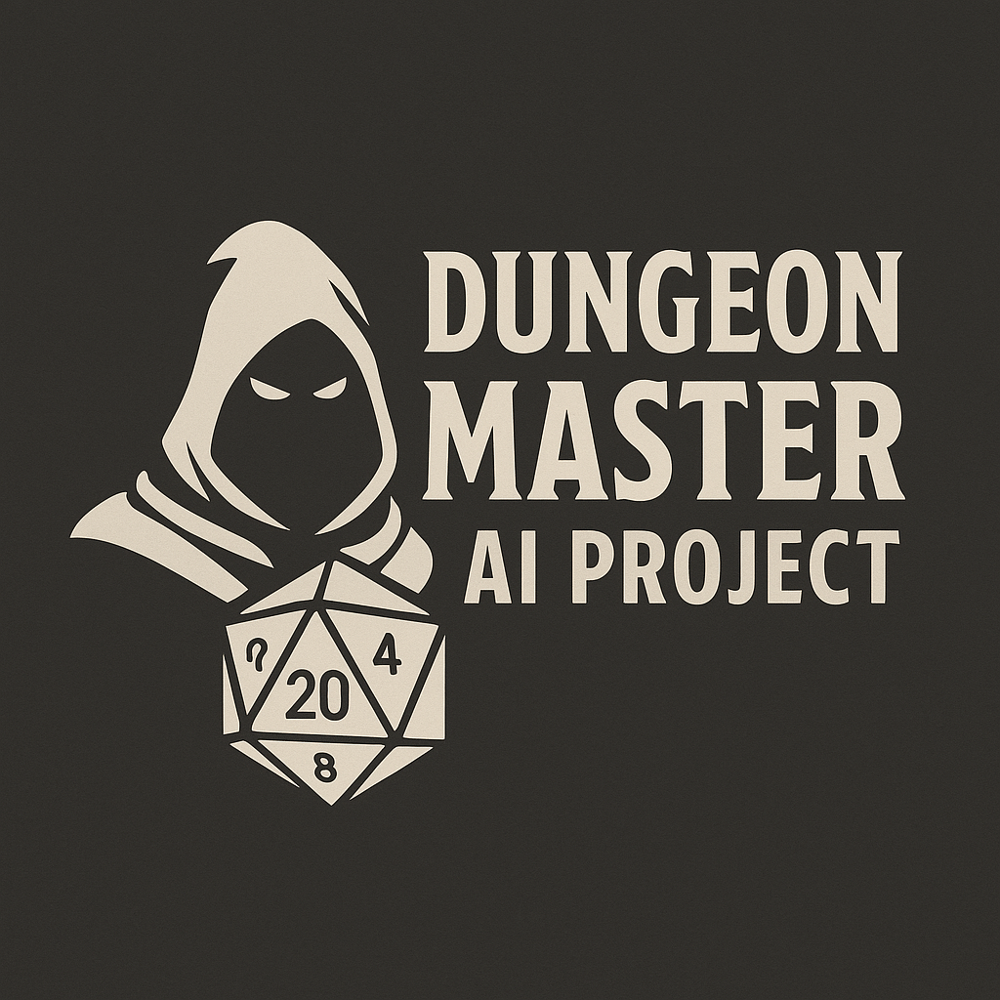

# Dungeon Master AI – Motore di Gioco RPG in Python



## Indice
- [Panoramica del Progetto](#panoramica-del-progetto)
- [Architettura del Progetto](#architettura-del-progetto)
- [Caratteristiche](#caratteristiche)
- [Tecnologie Utilizzate](#tecnologie-utilizzate)
- [Struttura del Progetto](#struttura-del-progetto)
- [Roadmap](#roadmap)
- [Installazione e Avvio](#installazione-e-avvio)
- [Sistema di Mappe](#sistema-di-mappe)
- [Sistema di Combattimento](#sistema-di-combattimento)
- [Sistema di Prove di Abilità](#sistema-di-prove-di-abilità)
- [Moduli di Stati](#moduli-di-stati)
  - [Stati Base](#stati-base)
  - [Stato Taverna](#stato-taverna)
  - [Stato Mappa](#stato-mappa)
  - [Stato Mercato](#stato-mercato)
  - [Stato Inventario](#stato-inventario)
  - [Stato Combattimento](#stato-combattimento)
  - [Stato Dialogo](#stato-dialogo)
- [Web Socket Events](#web-socket-events)
- [API Endpoints](#api-endpoints)
- [Ottimizzazioni e Miglioramenti](#ottimizzazioni-e-miglioramenti)
- [Sistema di Rendering](#sistema-di-rendering)
- [Integrazione MessagePack](#integrazione-messagepack)
- [Test](#test)
- [Frontend React](#frontend-react)
- [Contributi](#contributi)
- [Licenza](#licenza)

## Panoramica del Progetto

Questo repository contiene un motore di gioco di ruolo (RPG) sviluppato in Python, progettato con un'architettura orientata agli oggetti e basata su una macchina a stati finiti (FSM) a stack. Il progetto mira a evolversi in un sistema RPG guidato dall'intelligenza artificiale con narrazione ricca, dove un Dungeon Master virtuale potenziato da GPT migliora l'immersione del giocatore.

L'applicazione è divisa in due componenti principali:
- **Backend**: Core del motore di gioco in Python, gestisce tutta la logica di gioco
- **Frontend**: Interfaccia utente React con Pixi.js per la visualizzazione grafica

## Architettura del Progetto

Il progetto è organizzato in moduli ben definiti:

```
gioco_rpg/
├── main.py                 # Punto di ingresso del server
├── server.py               # Script di compatibilità per il server
├── server/                 # Modulo server Flask/SocketIO
│   ├── app.py              # Configurazione dell'app Flask
│   ├── routes/             # Endpoint API REST
│   └── websocket/          # Gestori WebSocket
├── core/                   # Logica principale del gioco
│   ├── game.py             # Loop di gioco e gestione stati
│   ├── io_interface.py     # Interfaccia I/O astratta
│   ├── stato_gioco.py      # Gestione dello stato globale
│   └── graphics_renderer.py # Rendering grafico
├── entities/               # Entità di gioco
│   ├── giocatore.py        # Classe del giocatore
│   ├── entita.py           # Classe base per le entità
│   ├── nemico.py           # Sistema di nemici
│   └── npg.py              # Personaggi non giocanti
├── states/                 # Stati di gioco (FSM)
│   ├── base/               # Stati base
│   ├── mappa/              # Esplorazione mappa
│   ├── combattimento/      # Sistema di combattimento
│   ├── inventario/         # Gestione inventario
│   ├── dialogo/            # Sistema di dialogo
│   └── mercato/            # Sistema di commercio
├── world/                  # Sistema mondo e mappe
│   ├── mappa.py            # Definizione mappa
│   ├── controller_mappa.py # Controllore delle mappe
│   └── gestore_mappe.py    # Gestione delle mappe di gioco
├── items/                  # Oggetti e elementi interattivi
├── util/                   # Funzioni di utilità
├── data/                   # Dati di gioco in formato JSON
│   ├── mappe/              # Definizioni mappe
│   ├── monsters/           # Dati dei mostri
│   ├── npc/                # Dati dei PNG
│   ├── items/              # Definizioni oggetti
│   └── classes/            # Classi di personaggio
├── frontend/               # Interfaccia utente React
│   ├── src/                # Codice sorgente React
│   ├── public/             # Asset pubblici
│   └── package.json        # Dipendenze frontend
└── assets/                 # Risorse grafiche e audio
```

Il gioco utilizza una **macchina a stati finiti a stack** (`BaseState`) per gestire le diverse fasi di gioco (esplorazione della mappa, combattimento, dialoghi, gestione dell'inventario), consentendo transizioni fluide e interazioni stratificate (ad esempio, l'apertura di un forziere mette in pausa l'esplorazione e attiva uno stato di dialogo o di bottino).

## Caratteristiche

- **Architettura modulare** pronta per l'estensione
- **Logica di gioco completa** (movimento, combattimento, dialoghi, inventario)
- **Sistema di mappe basato su ASCII** con controller di tile
- **Sistema factory per entità** per la generazione dinamica di contenuti
- **Completa separazione** della logica di gioco dall'interfaccia utente
- **Backend completamente testabile** 
- **Sistema centralizzato di caricamento dati** tramite file JSON
- **Sistema di combattimento avanzato** con selezione del tipo di mostro e livelli di difficoltà
- **Sistema di navigazione della mappa** con selezione della destinazione
- **Interazione migliorata** con pozioni e oggetti dell'inventario
- **Posizionamento migliorato** di PNG e oggetti interattivi sulle mappe
- **Interfaccia web** basata su React e Socket.IO
- **Visualizzazione grafica** tramite Pixi.js

## Tecnologie Utilizzate

### Backend
- **Python 3.10+**
- **Flask** - Framework web
- **Flask-SocketIO** - Comunicazione real-time
- **JSON** - Formato dati
- **MessagePack** - Serializzazione binaria efficiente

### Frontend
- **React 18** - Framework UI
- **Pixi.js** - Rendering grafico 2D
- **Socket.IO Client** - Comunicazione real-time con il server
- **Axios** - Richieste HTTP

## Struttura del Progetto

### 📁 Root del Progetto
- `start_gioco.bat` - Script batch per avviare sia il backend che il frontend del gioco
- `package.json` - File di configurazione per le dipendenze npm del progetto root
- `README.md` - Documentazione principale del progetto
- `LICENSE` - Licenza del progetto

### Core
- `game.py` - Implementazione della classe principale del gioco che gestisce tutto il flusso di gioco
- `io_interface.py` - Interfaccia per gestire l'input/output tra il gioco e l'utente
- `graphics_renderer.py` - Sistema di rendering grafico per la visualizzazione del gioco
- `stato_gioco.py` - Gestisce lo stato globale del gioco e la sua serializzazione/deserializzazione

### Server
- `app.py` - Implementazione principale dell'applicazione Flask e configurazione di Socket.IO
- `routes/` - Definizioni delle rotte API REST
- `websocket/` - Gestione delle connessioni e degli eventi WebSocket

### Frontend
- `src/` - Codice sorgente del frontend
  - `App.jsx` - Componente principale dell'applicazione React
  - `components/` - Componenti React riutilizzabili
  - `game/` - Logica di gioco specifica per il frontend
  - `api/` - Client API per comunicare con il backend
  - `pixi/` - Implementazioni specifiche per Pixi.js
  - `contexts/` - Definizioni dei contesti React per la gestione dello stato
  - `hooks/` - Hook React personalizzati

## Roadmap

✅ Sistema centralizzato di caricamento dati tramite data_manager.py utilizzando il formato JSON  
✅ Sistema di combattimento con mostri migliorato  
✅ Navigazione della mappa migliorata  
✅ Miglioramento dell'interazione con oggetti e pozioni  
✅ Miglioramento del posizionamento di PNG e oggetti interattivi sulle mappe  
✅ Interfaccia web React funzionante con comunicazione real-time
✅ Serializzazione MessagePack  
⬜ Implementare il Dungeon Master AI utilizzando GPT  
⬜ Miglioramento e aderenza alle regole ufficiali D&D  
⬜ Implementazione del sistema di magia e incantesimi  
⬜ Implementazione di combattimenti multipli (più nemici/alleati)  
⬜ Implementazione multiplayer online  
⬜ Implementazione di scenari di gioco generati dall'IA e volti realistici dei PNG  
⬜ Implementazione di scene di gioco generate dall'IA  
⬜ Integrazione della sintesi vocale AI per la narrazione del DM  

## Installazione e Avvio

### Prerequisiti
- Python 3.10 o superiore
- Node.js 16 o superiore
- npm

### Installazione

1. Clona il repository:
```
git clone https://github.com/tuousername/gioco_rpg.git
cd gioco_rpg
```

2. Configura l'ambiente virtuale Python:
```
cd gioco_rpg
python -m venv .venv
.venv\Scripts\activate
pip install -r requirements.txt
```

3. Installa le dipendenze frontend:
```
cd frontend
npm install
```

### Avvio

Per avviare il gioco con una singola azione, utilizza lo script batch fornito:
```
start_gioco.bat
```

Altrimenti, avvia manualmente i componenti:

1. Avvia il backend:
```
cd gioco_rpg
.venv\Scripts\activate
python main.py
```

2. Avvia il frontend:
```
cd gioco_rpg\frontend
npm start
```

3. Accedi all'applicazione:
   - Apri il browser e vai a `http://localhost:3000`

## Sistema di Mappe

### Struttura delle Mappe

Ogni mappa è definita in un file JSON nella directory `data/mappe/`. I file JSON devono seguire una struttura standard per garantire la compatibilità con il sistema di caricamento.

### Schema Standard di una Mappa

```json
{
  "nome": "nome_mappa",
  "larghezza": 20,
  "altezza": 15,
  "tipo": "interno",
  "descrizione": "Descrizione della mappa",
  "griglia": [
    [1, 1, 1, 1, ...],
    [1, 0, 0, 0, ...],
    ...
  ],
  "oggetti": {},
  "npg": {},
  "porte": {
    "(x, y)": ["mappa_destinazione", x_dest, y_dest]
  },
  "pos_iniziale_giocatore": [5, 5]
}
```

### Campi Principali

| Campo | Tipo | Descrizione |
|-------|------|-------------|
| `nome` | string | Nome univoco della mappa, usato come identificatore |
| `larghezza` | integer | Larghezza della mappa in celle |
| `altezza` | integer | Altezza della mappa in celle |
| `tipo` | string | Tipo di mappa: "interno", "esterno", "dungeon", ecc. |
| `descrizione` | string | Descrizione testuale della mappa |
| `griglia` | array 2D | Matrice che rappresenta il terreno: 0=vuoto, 1=muro, 2=porta |
| `oggetti` | object | Dizionario di oggetti con chiave "(x, y)" |
| `npg` | object | Dizionario di NPG con chiave "(x, y)" |
| `porte` | object | Dizionario di porte con chiave "(x, y)" e valore [mappa_dest, x_dest, y_dest] |
| `pos_iniziale_giocatore` | array | Posizione iniziale del giocatore [x, y] |

### Posizionamento di Oggetti e NPC

Gli oggetti interattivi e gli NPC non vengono direttamente definiti nel file della mappa, ma vengono caricati dai file di configurazione corrispondenti.

#### Oggetti Interattivi

Gli oggetti interattivi sono definiti in `data/items/oggetti_interattivi.json` e le loro posizioni sulle mappe in `data/items/mappe_oggetti.json`.

Struttura di `mappe_oggetti.json`:
```json
{
  "nome_mappa": [
    {
      "nome": "nome_oggetto",
      "posizione": [x, y]
    },
    ...
  ],
  ...
}
```

#### NPC

Gli NPC sono definiti attraverso il codice e le loro posizioni sulle mappe in `data/npc/mappe_npg.json`.

## Sistema di Combattimento

Il sistema di combattimento implementa un meccanismo a turni per gestire i combattimenti tra giocatori e nemici, supportando diverse azioni e abilità.

### API per il Combattimento

#### Endpoints HTTP

- **POST /combattimento/inizia**: Inizia un nuovo combattimento.
  - Parametri: `id_sessione`, `nemici_ids` (opzionale), `tipo_incontro` (casuale, imboscata, preparato)
  - Risposta: Informazioni sui partecipanti e sullo stato iniziale del combattimento

- **GET /combattimento/stato**: Ottiene lo stato attuale del combattimento.
  - Parametri: `id_sessione`
  - Risposta: Stato dettagliato del combattimento in corso (turno, partecipanti, HP, ecc.)

- **POST /combattimento/azione**: Esegue un'azione durante il combattimento.
  - Parametri: `id_sessione`, `tipo_azione` (attacco, incantesimo, oggetto, movimento, passa), `parametri`
  - Risposta: Risultato dell'azione e stato aggiornato del combattimento

### Flusso di un Combattimento Tipico

1. **Inizializzazione**:
   - Il client richiede l'inizio di un combattimento tramite `/combattimento/inizia`
   - Il server genera o usa i nemici specificati
   - Il server calcola l'iniziativa per determinare l'ordine dei turni
   - Il server emette l'evento `combattimento_iniziato`

2. **Turni di Combattimento**:
   - Il server determina di chi è il turno corrente
   - Il client richiede le azioni disponibili con `/combattimento/azioni_disponibili`
   - Il client esegue un'azione usando `/combattimento/azione`
   - Il server elabora l'azione e i suoi effetti
   - Il server emette eventi come `combattimento_azione_eseguita`
   - Se è il turno di un nemico, il server determina ed esegue automaticamente l'azione

3. **Fine del Combattimento**:
   - Il combattimento termina quando tutti i nemici sono sconfitti o il giocatore fugge/viene sconfitto
   - Il server emette l'evento `combattimento_terminato`
   - Il client viene informato dell'esito e delle ricompense 

## Sistema di Prove di Abilità

Il sistema implementa un meccanismo completo per eseguire prove di abilità, sia per il giocatore che per gli NPC, supportando anche confronti diretti tra entità.

### API per Prove di Abilità

#### Endpoints HTTP

- **POST /prova_abilita/inizia**: Inizia una nuova prova di abilità.
  - Parametri: `id_sessione`, `tipo_prova` (giocatore, npg, confronto)
  - Risposta: Stato iniziale della prova

- **GET /prova_abilita/abilita_disponibili**: Ottiene le abilità disponibili per un'entità.
  - Parametri: `id_sessione`, `entita_id` (opzionale, default: giocatore)
  - Risposta: Lista delle abilità disponibili

- **POST /prova_abilita/esegui**: Esegue una prova di abilità.
  - Parametri: `id_sessione`, `modalita` (semplice, avanzata), `abilita`, `entita_id`, `target_id`, `difficolta`
  - Risposta: Risultato dettagliato della prova

### Tipi di Prove

1. **Prove Base**: Tiro semplice contro una difficoltà
2. **Prove contro NPG**: Confronto di abilità tra giocatore e NPG
3. **Prove con Oggetti**: Interazione con oggetti del mondo di gioco

### Abilità Supportate

- Caratteristiche di base: Forza, Destrezza, Costituzione, Intelligenza, Saggezza, Carisma
- Abilità specifiche: Percezione, Persuasione, Intimidire, ecc.

## Moduli di Stati

### Stati Base

Questo modulo contiene le classi base su cui si costruiscono tutti gli stati del gioco. È stato suddiviso in più file per migliorare la manutenibilità e la scalabilità del codice.

#### Struttura

- **base_state.py** - Contiene la classe `BaseState`, che è la classe base per tutti gli stati del gioco.
- **base_game_state.py** - Contiene la classe `BaseGameState`, che estende `BaseState` aggiungendo gestione dei comandi e interfaccia utente.
- **ui.py** - Contiene la classe `BaseUI` con funzionalità di visualizzazione e rendering dell'interfaccia utente.
- **interazioni.py** - Contiene la classe `BaseInterazioni` con metodi per gestire le interazioni con oggetti e NPC sulla mappa.
- **serializzazione.py** - Contiene la classe `BaseSerializzazione` con metodi per convertire gli stati in dizionari e viceversa.

### Stato Taverna

Questo modulo implementa lo stato Taverna del gioco RPG, ora aggiornato per utilizzare l'architettura EventBus.

#### Struttura del Modulo

- `taverna_state.py`: Classe principale che estende `EnhancedBaseState` e gestisce lo stato generale
- `movimento.py`: Gestione del movimento del giocatore all'interno della taverna
- `oggetti_interattivi.py`: Definizione e gestione degli oggetti interattivi presenti nella taverna
- `ui_handlers.py`: Gestione dell'interfaccia utente specifica della taverna
- `menu_handlers.py`: Gestione dei menu e delle opzioni di interazione della taverna

#### Eventi Supportati

Lo stato Taverna supporta i seguenti eventi:

- `PLAYER_MOVE`: Gestisce il movimento del giocatore nella taverna
- `PLAYER_INTERACT`: Gestisce l'interazione con oggetti o NPC nella taverna
- `MENU_SELECTION`: Gestisce la selezione di opzioni di menu
- `MENU_CHANGED`: Gestisce i cambiamenti di menu attivo
- `UI_DIALOG_OPEN`: Gestisce l'apertura di un dialogo
- `UI_DIALOG_CLOSE`: Gestisce la chiusura di un dialogo

### Stato Mappa

Questo modulo contiene l'implementazione dello stato mappa del gioco RPG.

#### Struttura del Modulo

- **mappa_state.py** - Classe principale che coordina tutte le funzionalità
- **ui.py** - Gestione dell'interfaccia utente e della visualizzazione
- **movimento.py** - Logica per il movimento del giocatore sulla mappa
- **interazioni.py** - Gestione delle interazioni con oggetti, NPC e ambiente
- **ui_handlers.py** - Gestori per gli eventi UI (click, keypress, menu)
- **serializzazione.py** - Funzioni per il salvataggio e caricamento dello stato

#### Funzionalità Principali

- Movimento nelle quattro direzioni cardinali
- Interazioni con oggetti e NPC
- Menu interattivi e leggenda mappa
- Cambio tra diverse mappe

### Stato Mercato

Questo modulo implementa lo stato del mercato all'interno del gioco RPG.

#### Struttura del modulo

- **mercato_state.py** - Classe principale che integra tutti gli altri componenti
- **oggetti_interattivi.py** - Definizione degli oggetti interattivi presenti nel mercato
- **menu_handlers.py** - Gestione dei menu e delle opzioni di interazione
- **ui_handlers.py** - Gestione degli eventi dell'interfaccia utente
- **movimento.py** - Gestione del movimento del giocatore all'interno del mercato
- **dialogo.py** - Gestione delle conversazioni con gli NPC del mercato

#### Interazioni disponibili

Nel mercato il giocatore può:

- Comprare pozioni e oggetti
- Vendere oggetti dal proprio inventario
- Parlare con vari NPC (Araldo, Violetta, Gundren)
- Esplorare e interagire con oggetti (bancarella, baule, statua antica, ecc.)
- Visualizzare la mappa del mercato
- Navigare tra diverse aree del mercato

### Stato Inventario

Questo modulo gestisce tutte le funzionalità relative all'inventario del giocatore.

#### Struttura

Il modulo è organizzato nei seguenti file:

- `inventario_state.py`: Classe principale che gestisce lo stato dell'inventario
- `ui_handlers.py`: Gestione dell'interfaccia utente e visualizzazione
- `filtri.py`: Funzioni di filtro per gli oggetti dell'inventario
- `oggetti.py`: Gestione delle interazioni con gli oggetti
- `menu_handlers.py`: Gestione delle azioni e scelte di menu

#### Flusso di utilizzo

1. Il giocatore entra nello stato di gestione inventario
2. Viene mostrato il menu principale con le opzioni disponibili
3. Il giocatore può scegliere di:
   - Usare un oggetto
   - Equipaggiare un oggetto
   - Rimuovere equipaggiamento
   - Esaminare un oggetto
   - Tornare allo stato precedente

### Stato Combattimento

Questo modulo gestisce il sistema di combattimento del gioco.

#### Struttura del modulo

Il modulo è organizzato in diversi file:

- **combattimento_state.py**: Contiene la classe principale che coordina tutti i componenti
- **azioni.py**: Gestisce le azioni possibili durante il combattimento
- **turni.py**: Gestisce la sequenza dei turni e l'alternanza tra giocatore e nemico
- **ui.py**: Gestisce l'interfaccia utente del combattimento

#### Funzionalità principali

- Combattimento a turni con sistema di lancio di dadi
- Gestione dell'equipaggiamento durante il combattimento
- Uso di oggetti dal proprio inventario
- Possibilità di tentare la fuga
- Interfaccia grafica con barre HP e animazioni
- Ricompense al termine del combattimento

### Stato Dialogo

Questo modulo gestisce le interazioni di dialogo tra il giocatore e i personaggi non giocanti (NPG).

#### Struttura del Modulo

Il modulo è stato suddiviso in diversi file:

- **dialogo_state.py**: Classe principale e metodi core che gestiscono lo stato del dialogo.
- **ui.py**: Funzioni per la gestione dell'interfaccia grafica del dialogo.
- **ui_handlers.py**: Handler per eventi dell'interfaccia utente (click, selezioni, menu).
- **effetti.py**: Gestione degli effetti che possono verificarsi durante il dialogo.
- **serializzazione.py**: Metodi per la serializzazione e deserializzazione dello stato del dialogo.

#### Eventi supportati

Il modulo gestisce i seguenti tipi di eventi:

- **UI_DIALOG_OPEN**: Apertura di un dialogo (`dialog_id`, `title`, `content`, `options`)
- **UI_DIALOG_CLOSE**: Chiusura di un dialogo
- **DIALOG_CHOICE**: Selezione di un'opzione di dialogo (`choice`, `dialog_id`)
- **MENU_SELECTION**: Selezione dal menu contestuale (`menu_id`, `selection`)
- **INVENTORY_ITEM_ADDED**: Aggiunta di un oggetto all'inventario (`item_id`, `item_type`, `quantity`)

## Web Socket Events

### Eventi da Frontend a Backend

| Evento | Descrizione | Parametri |
|--------|-------------|-----------|
| `join_game` | Entra in una sessione di gioco | `{id_sessione: string}` |
| `game_event` | Invia un evento di gioco | `{id_sessione: string, type: string, data: object}` |
| `request_map_data` | Richiede dati mappa | `{id_sessione: string, map_id: string}` |
| `player_input` | Invia input del giocatore | `{id_sessione: string, type: string, data: object}` |
| `request_game_state` | Richiede stato del gioco | `{id_sessione: string}` |

### Eventi da Backend a Frontend

| Evento | Descrizione | Dati |
|--------|-------------|------|
| `game_update` | Aggiornamento stato gioco | `{entities: array, events: array, timestamp: number}` |
| `map_data` | Dati mappa | `{id: string, tiles: array, width: number, height: number, layers: array}` |
| `render_update` | Aggiornamento rendering | `{events: array, timestamp: number}` |
| `render_entity` | Renderizza entità | `{id: string, type: string, x: number, y: number, sprite: string, ...}` |
| `message` | Messaggio di gioco | `{text: string, type: "narrative"|"system"|"error"}` |

## API Endpoints

- `GET /` - Informazioni sull'API
- `GET /ping` - Verifica connessione
- `GET /salvataggi` - Ottieni lista salvataggi
- `POST /elimina_salvataggio` - Elimina un salvataggio
- `GET /assets/info` - Ottieni informazioni sugli asset disponibili
- `POST /assets/update` - Aggiorna le informazioni sugli asset
- `GET /assets/file/<path:asset_path>` - Ottiene un file asset specifico
- `POST /inizia` - Crea una nuova partita
- `POST /comando` - Invia un comando alla partita
- `GET /stato` - Ottiene lo stato attuale della partita
- `POST /salva` - Salva la partita corrente
- `POST /carica` - Carica una partita esistente
- `GET /mappa` - Ottiene informazioni sulla mappa attuale
- `POST /muovi` - Muove il giocatore nella direzione specificata

## Ottimizzazioni e Miglioramenti

### Recenti miglioramenti (Giugno 2024)

Nel recente aggiornamento sono state apportate importanti correzioni che migliorano significativamente la stabilità e le prestazioni del frontend:

#### 🔧 Ottimizzazioni React Hooks
- **Corretti errori Hook**: Risolti problemi legati alla regola "React Hook cannot be called inside a callback"
- **Gestione Context**: Migliorata l'estrazione delle funzioni dai context Socket.IO
- **Dependency Arrays**: Corrette le dipendenze negli useEffect per prevenire cicli di rendering infiniti

#### ⚡ Miglioramenti WebSocket
- **Lifecycle Management**: Perfezionata la gestione del ciclo di vita delle connessioni socket
- **Event Handling**: Migliorato il sistema di gestione degli eventi con correzioni ai listener map_change_complete
- **Context Distribution**: Ottimizzato l'uso del context Socket.IO in tutta l'applicazione

#### 📋 File corretti
- **App.jsx**: Corretta l'implementazione di useSocket per rispettare le regole dei React Hooks
- **MapSelectState.jsx**: Rimosse variabili non utilizzate dal destructuring di useSocket
- **MapContainer.jsx**: Rimosso useMemo dall'import e ottimizzato l'uso di emitWithAck

#### 📊 Vantaggi
- **Stabilità**: Eliminati errori console e warnings ESLint
- **Performance**: Ridotto il rischio di memory leaks e re-rendering non necessari
- **Manutenibilità**: Codice più pulito e conforme alle best practices di React
- **Compatibilità**: Migliore supporto a future versioni di React con strict mode

### WebSocket ottimizzati
- Configurazione aggiornata per utilizzare Eventlet come backend per WebSocket
- Parametri ping/pong configurati correttamente per evitare timeout di connessione
- Gestione migliorata della riconnessione client per maggiore stabilità
- Riduzione del sovraccarico nella trasmissione dati

### Sistema di sprite sheet
- Implementato un sistema completo di sprite sheet per ridurre le richieste HTTP
- Gestore dedicato per la generazione e il caricamento dinamico degli sprite sheet
- API per la generazione degli sprite sheet al volo
- Ottimizzazione del rendering lato client grazie al consolidamento delle immagini

## Sistema di Rendering

### Componenti Principali

Il sistema di rendering delle mappe è composto dai seguenti componenti:

1. **TileAtlas**: Gestisce le texture dei tile in un unico atlante per minimizzare i cambi di texture.
2. **OptimizedMapRenderer**: Renderer per mappe di grandi dimensioni che implementa viewport culling e chunk.
3. **CachedMapRenderer**: Renderer che utilizza RenderTexture per cachare gli elementi statici della mappa.
4. **MapRendererFactory**: Factory che seleziona automaticamente il renderer più appropriato.

### Quando Usare Ciascun Renderer

- **MapRenderer standard**: Per mappe piccole (<50x50 tile) con pochi oggetti (<100).
- **OptimizedMapRenderer**: Per mappe grandi con molti oggetti, dove il culling è essenziale.
- **CachedMapRenderer**: Per mappe con molti elementi statici e pochi elementi dinamici.

### Ottimizzazioni Implementate

#### 1. Texture Atlas

Tutte le texture dei tile sono organizzate in un unico atlante per minimizzare i cambi di contesto grafico.

#### 2. Culling del Viewport

Solo i chunk visibili nel viewport vengono renderizzati.

#### 3. Batching per Tipo

Gli oggetti dello stesso tipo vengono raggruppati insieme per ottimizzare il rendering.

#### 4. Caching degli Elementi Statici

Gli elementi statici della mappa vengono renderizzati una sola volta in una RenderTexture.

## Integrazione MessagePack

MessagePack è un formato di serializzazione binario che permette scambi di dati tra diversi linguaggi di programmazione. È simile a JSON ma con una rappresentazione più compatta e prestazioni migliori sia in termini di velocità di serializzazione/deserializzazione che di dimensione dei dati.

### Vantaggi di MessagePack
- **Prestazioni**: Fino a 5 volte più veloce di JSON per la serializzazione/deserializzazione
- **Dimensione**: Occupa circa il 30-50% in meno rispetto a JSON
- **Compatibilità**: Supporta gli stessi tipi di dati di JSON
- **Facilità di utilizzo**: API simile a JSON, facilmente adottabile

### Implementazione nel Gioco RPG
MessagePack è stato implementato in diversi componenti del sistema:

1. **Classe `OggettoInterattivo`**:
   - Aggiunto metodo `to_msgpack()` per serializzare oggetti in formato MessagePack
   - Aggiunto metodo statico `from_msgpack()` per deserializzare oggetti

2. **Classe `World`**:
   - Aggiunto metodo `serialize_msgpack()` per serializzare il mondo di gioco
   - Aggiunto metodo statico `deserialize_msgpack()` per deserializzare il mondo

3. **Funzioni di gestione sessione**:
   - Modificata `salva_sessione()` per salvare utilizzando MessagePack
   - Modificata `carica_sessione()` per caricare utilizzando MessagePack con fallback su JSON

### Impatto sulle prestazioni

L'utilizzo di MessagePack migliora significativamente le prestazioni del gioco:
- Riduce il tempo di salvataggio e caricamento delle sessioni
- Risolve i problemi di serializzazione per oggetti complessi
- Diminuisce l'utilizzo della memoria e dello spazio su disco

## Test

La directory `test` contiene tutti i test per il progetto di gioco RPG. I test sono organizzati per tipologia in diverse cartelle.

### Struttura dei Test

- **unitari**: Test delle singole componenti del gioco in isolamento
- **integrazione**: Test dell'interazione tra più componenti
- **regressione**: Test per verificare che nuove funzionalità non rompano il codice esistente
- **e2e**: Test end-to-end che verificano flussi di gioco completi
- **carico**: Test di performance sotto carico
- **ui**: Test dell'interfaccia utente
- **manuali**: Test che richiedono intervento umano per la verifica

### Test Frontend

La directory `test/ui` contiene i test per l'interfaccia utente e i componenti frontend del gioco RPG.

#### Struttura dei Test Frontend
- **test_frontend_components.py**: Test di base per i componenti React
- **test_socket_service.py**: Test per il servizio WebSocket utilizzato nella comunicazione client-server
- **test_game_canvas.py** (da implementare): Test per il rendering grafico con Pixi.js

#### Prerequisiti per i Test Frontend
1. **Per test unitari dei componenti React**:
   - Jest (da implementare)
   - React Testing Library (da implementare)

2. **Per test Socket.IO**:
   - Python con unittest/pytest
   - Mock appropriati per simulare Socket.IO

3. **Per test e2e con Selenium**:
   - Selenium WebDriver
   - Chrome/Firefox WebDriver installato e configurato
   - Server di gioco in esecuzione su localhost:5000

### Test Server

La suite di test include ora test dedicati per i componenti server dell'applicazione:

#### 1. Test API REST
I test per le API REST si trovano nella cartella `test/server/routes` e verificano il corretto funzionamento delle route del server.

#### 2. Test WebSocket
I test per le comunicazioni WebSocket si trovano nella cartella `test/server/websocket` e verificano la corretta gestione degli eventi in tempo reale.

#### 3. Test End-to-End Server
La cartella `test/e2e` contiene test che verificano il flusso completo del server.

## Frontend React

Una guida API per integrare un'applicazione frontend sviluppata con React e Pixi.js con il backend del gioco RPG.

### Setup Connessione

Per iniziare, è necessario installare le dipendenze necessarie:

```bash
npm install react react-dom pixi.js socket.io-client
```

Quindi, creare una connessione Socket.IO all'URL del server:

```javascript
import io from 'socket.io-client';

// Connessione al server
const socket = io('http://localhost:5000');

// Gestione eventi di connessione
socket.on('connect', () => {
  console.log('Connesso al server');
});

socket.on('disconnect', () => {
  console.log('Disconnesso dal server');
});

// Gestione errori
socket.on('error', (error) => {
  console.error('Errore socket:', error);
});
```

### Esempio di componente React-Pixi.js:

```jsx
import React, { useRef, useEffect } from 'react';
import * as PIXI from 'pixi.js';

const GameRenderer = ({ socket, sessionId }) => {
  const pixiContainer = useRef(null);
  const app = useRef(null);
  const entities = useRef({});
  
  useEffect(() => {
    // Inizializza Pixi Application
    if (!app.current) {
      app.current = new PIXI.Application({
        width: 800,
        height: 600,
        backgroundColor: 0x1099bb,
        resolution: window.devicePixelRatio || 1,
      });
      pixiContainer.current.appendChild(app.current.view);
      
      // Sottoscrivi agli eventi di rendering
      socket.on('render_clear', handleRenderClear);
      socket.on('render_entity', handleRenderEntity);
      socket.on('render_particles', handleRenderParticles);
      socket.on('render_ui', handleRenderUI);
      socket.on('render_complete', handleRenderComplete);
      
      // Avvia il ciclo di rendering
      requestRenderUpdates();
    }
    
    return () => {
      // Cleanup alla dismissione
      socket.off('render_clear', handleRenderClear);
      socket.off('render_entity', handleRenderEntity);
      socket.off('render_particles', handleRenderParticles);
      socket.off('render_ui', handleRenderUI);
      socket.off('render_complete', handleRenderComplete);
      
      if (app.current) {
        app.current.destroy(true, true);
        app.current = null;
      }
    };
  }, []);
  
  // Altre funzioni di gestione...
  
  return <div ref={pixiContainer} className="game-renderer"></div>;
};

export default GameRenderer;
```

## Contributi

Se desideri contribuire, segui questi passaggi:

1. Fai un fork del repository
2. Crea un branch per la tua feature (`git checkout -b feature/nome-feature`)
3. Effettua i tuoi cambiamenti
4. Esegui i test
5. Fai commit dei tuoi cambiamenti (`git commit -m 'Aggiunge nuova feature'`)
6. Effettua il push sul branch (`git push origin feature/nome-feature`)
7. Apri una Pull Request

Sto cercando collaboratori che vogliano aiutare a costruire:
- Miglioramenti all'interfaccia web
- Motore narrativo basato su IA (GPT)
- Trama e world-building
- Feedback UI/UX o playtesting

## Licenza

Questo progetto è rilasciato sotto licenza MIT.


